# HUMIDITY READINGS USING RASBERRY Pi 3, DHT22 SENSOR and PYTHON PROGRAMMING
  
# SAMUEL 2235890 
  
Using some simple Python code and a Raspberry Pi, the DHT22 will allow real-time humidity readings to be read to the Pi, with reasonable accuracy. The Raspberry Pi DHT22 sensor makes for an affordable, easy-to-use, and reliable sensor due to its simple 4-pin wiring and greater accuracy. 
  
Components Required 
•	Raspberry Pi 3
•	Breadboard
•	Male-Female Jumper Wires (3)
•	DHT22 Temperature & Humidity Sensor
•	10KΩ resistor
  
# DHT22 Raspberry Pi Connection
In the diagram below, a 10KΩ pull-up resistor is added between the VCC and data pin of the DHT22 sensor. This resistor is needed to sustain a HIGH signal to the microcontroller (Raspberry Pi) and maintain constant communication between the sensor and the Pi.
  
•	I connected VCC (Pin 1) to 5v (Pin 04) on my Raspberry Pi 3,
•	the Data pin (Pin 2) to GPIO04 (Pin 07)
•	and GND (Pin 4) to GND (Pin 06) on the Raspberry Pi
•	I connected a 10KΩ resistor between the VCC (Pin 1) and Data pin (Pin 2) on the DHT22 sensor.
  
**![Picture 1. The rasberry pi 3 and other nodes connection]**
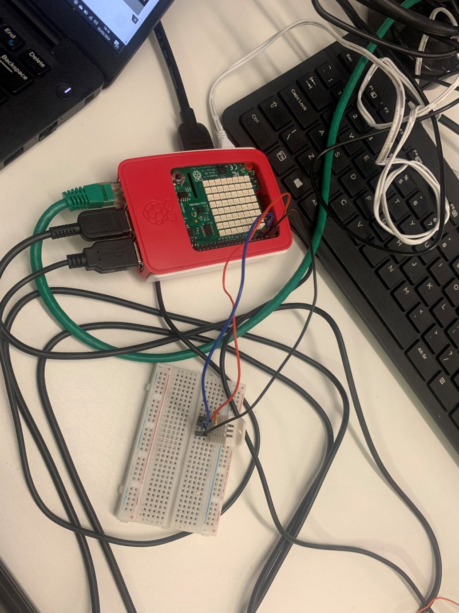
*Figure 1
  
  
The Thorny Snapshots containing the Python Code below:
  
I imported the Adafruit client, feed, request-error, and data from Ada fruit to connect my readings from the Raspberry Pi to the Adafruit feeds. 
I imported Adafruit DHT for my cable connections and the DHT22. 
The Adafruit Key was also imported to link my Adafruit account to the python code. 
Sleep was imported from time 
Humidity value was gotten from the sense hat that was imported.
  
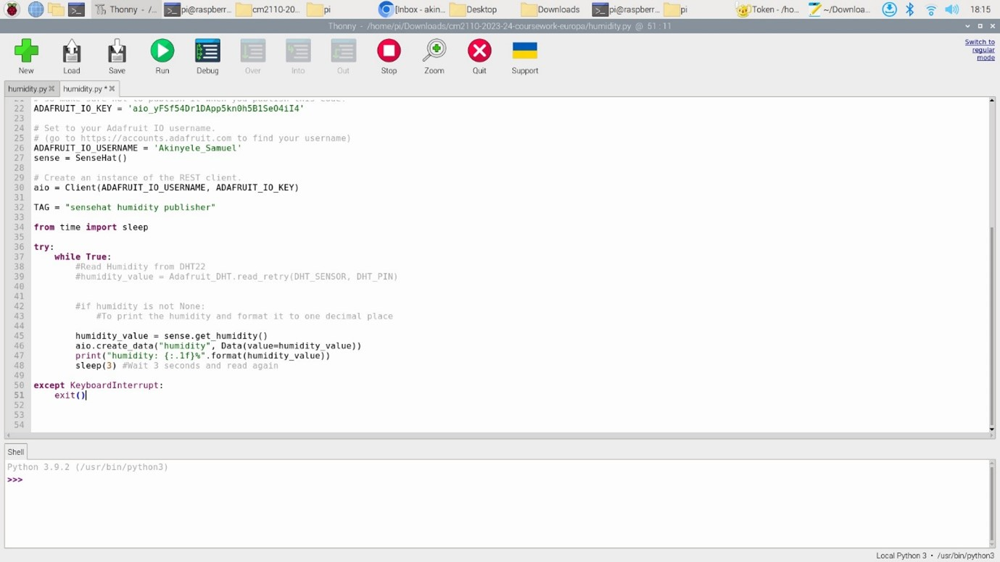
*Figure 2
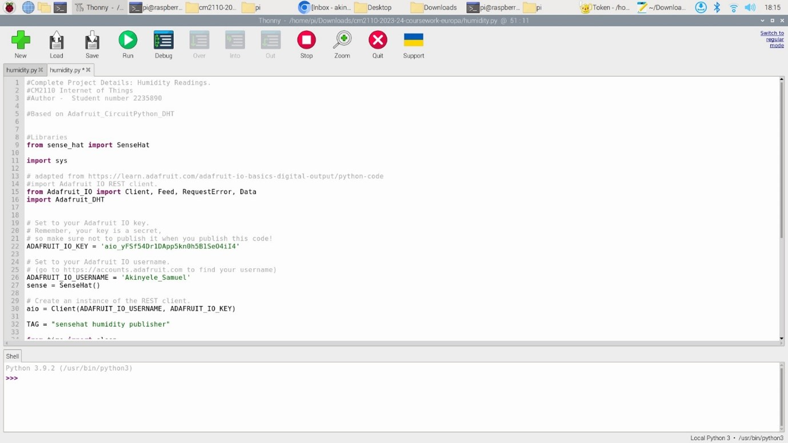
*Figure 3
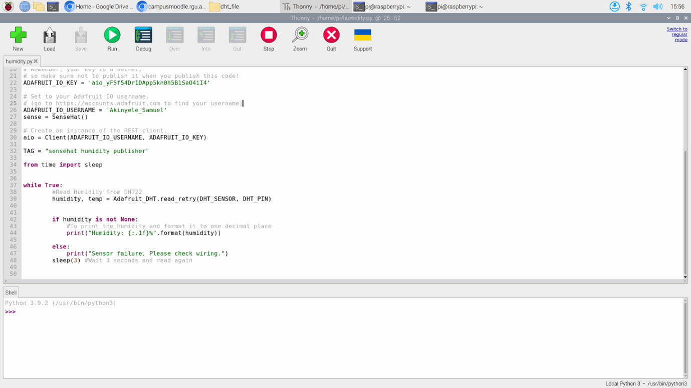
*Figure 4
  
# Getting the humidity readings on the Thorny Python Shell:
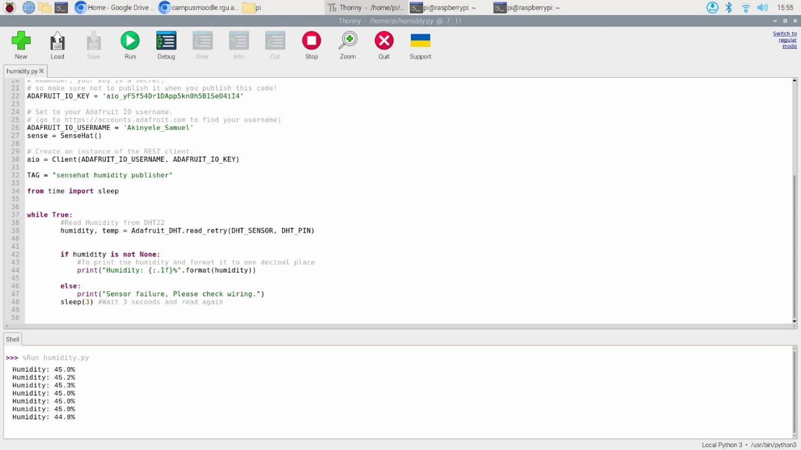
*Figure 5
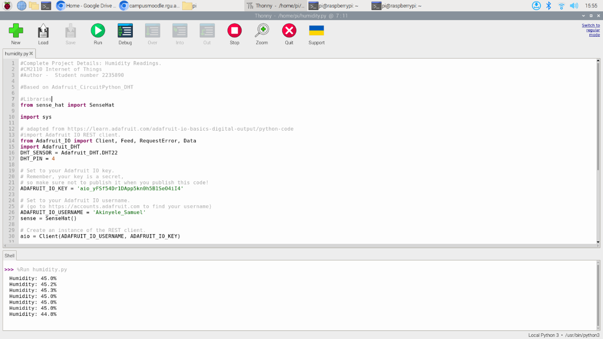
*Figure 6
  
# The commands used:
 I created a directory on the Desktop, named Coursework, and another directory in the coursework folder named dht_file. 
  
 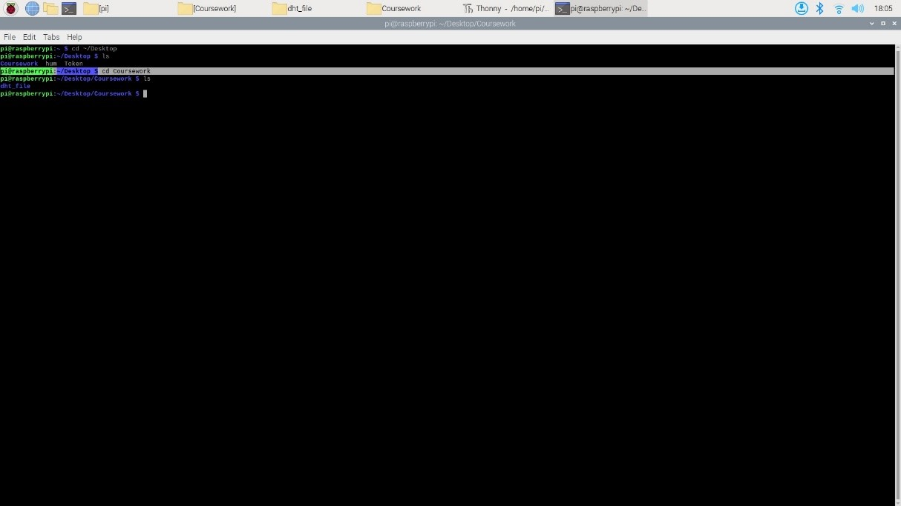
 *Figure 7
  
 I installed the DHT library in a virtual environment. Creating a virtual environment will isolate the Python libraries we’re using, in this case, the DHT library, from the rest of the system.
-	cd ~/Desktop/dht_test 
  
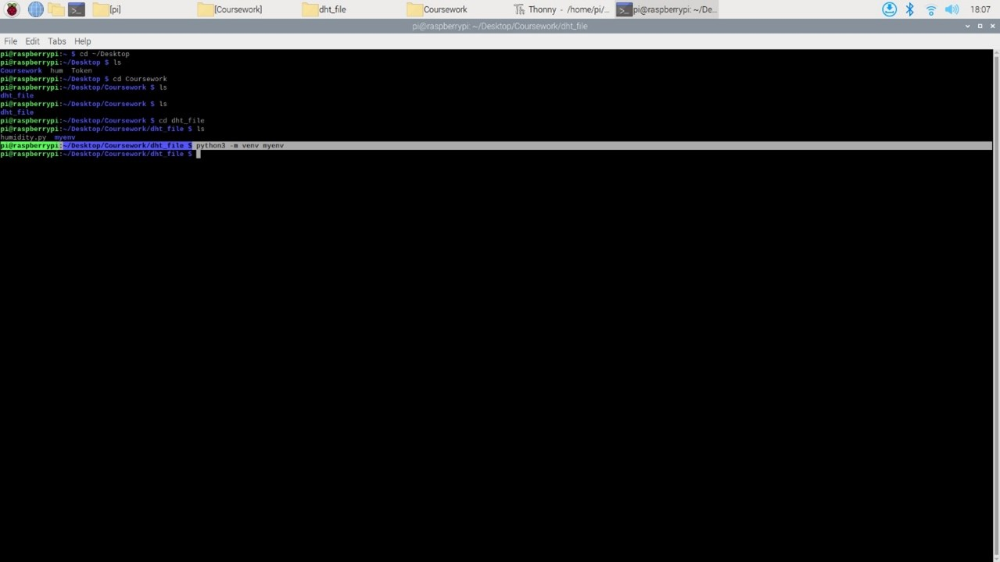
*Figure 8
  
Created a virtual environment for this directory called myenv. This is the same directory where I installed the DHT library. 
-python3 -m venv myenv
  

*Figure 9
  
To activate the virtual environment
-	source myenv/bin/activate
  

*Figure 10
  
Installing the Adafruit_CircuitPython_DHT Library
Now that we are in our virtual environment, we can install the library, using the following command:
-	python3 -m pip install adafruit-circuitpython-dht
  
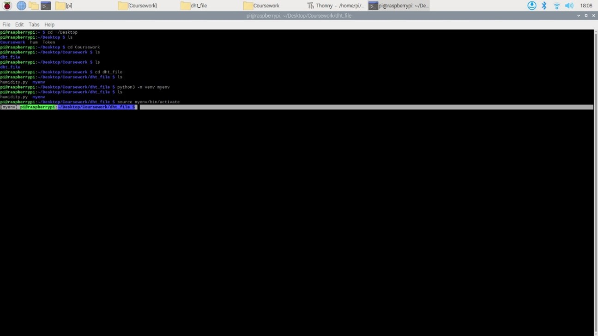
*Figure 11
  
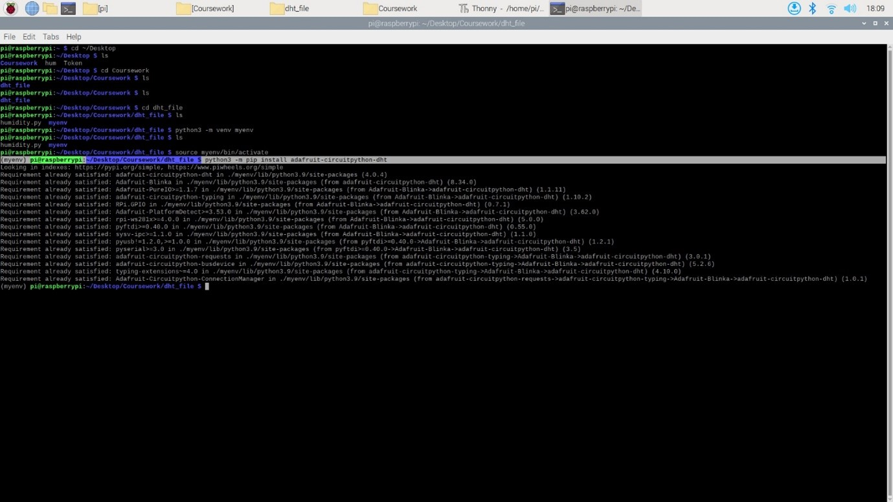
*Figure 12
  
To run the python code to get the humidity readings 
-	python humidity.py
  
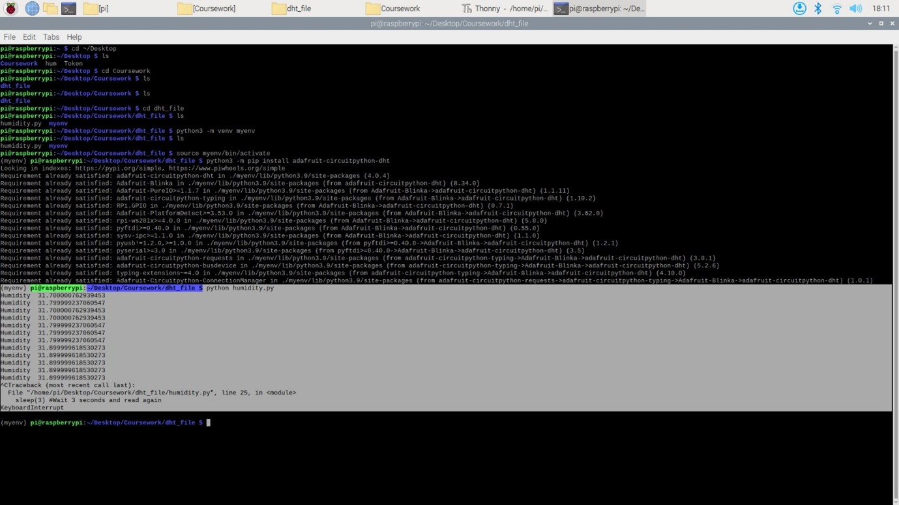
*Figure 13 
  
Getting the readings in a formatted version
  

*Figure 14
  
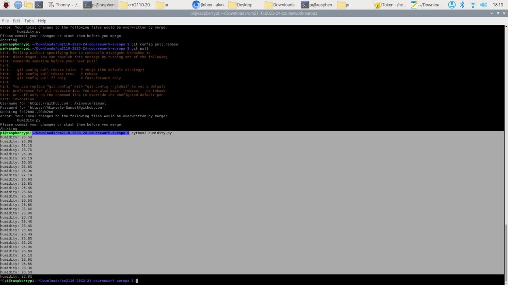
*Figure 15
  
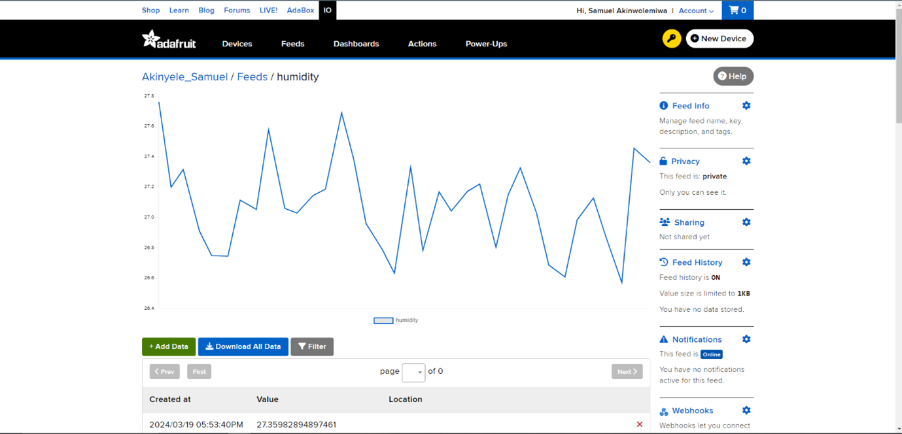
*Figure 16
Humidity readings from my python code on raspberry pi being published to my Adafruit feeds. 
  
# References 
https://www.tech-sparks.com/raspberry-pi-dht22-sensor-project/
  
https://randomnerdtutorials.com/raspberry-pi-dht11-dht22-python/
  